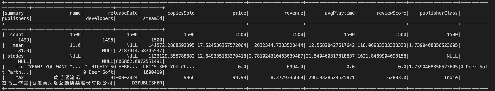
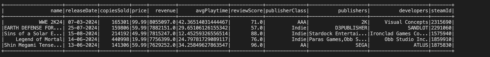

# Video Game Sales Data Analysis

This project uses PySpark to analyze a dataset of the top 1500 video games by revenue for 2024, providing statistical insights and performing SQL queries.

## Data Overview
The dataset contains the following key attributes for each game:
- **name**: Title of the video game.
- **releaseDate**: Date the game was released.
- **copiesSold**: Number of copies sold.
- **price**: Sale price of the game.
- **revenue**: Total revenue generated from sales.
- **avgPlaytime**: Average playtime in hours.
- **reviewScore**: User review score.
- **publisherClass**: Category of the publisher (e.g., AAA, Indie).
- **publishers**: Name(s) of the publisher(s).
- **developers**: Name(s) of the developer(s).
- **steamId**: Unique identifier on the Steam platform.

## Descriptive Statistics
The analysis includes:
- **Count**: The number of non-null values in each column, showing data completeness.
- **Mean**: Average values for numeric columns, highlighting trends such as average `price` (17.52) and `revenue` (2.63 million).
- **Standard Deviation**: Indicates variability in the data, such as high revenue fluctuations.
- **Min and Max**: Range of values for each column, including strings and numeric data. For example, the minimum `reviewScore` is 0, while the maximum is 62883.0, which may suggest a data inconsistency.





## Sample SQL Query
The following query retrieves the first 5 entries from the dataset:

```sql
SELECT * FROM steam_data LIMIT 5

